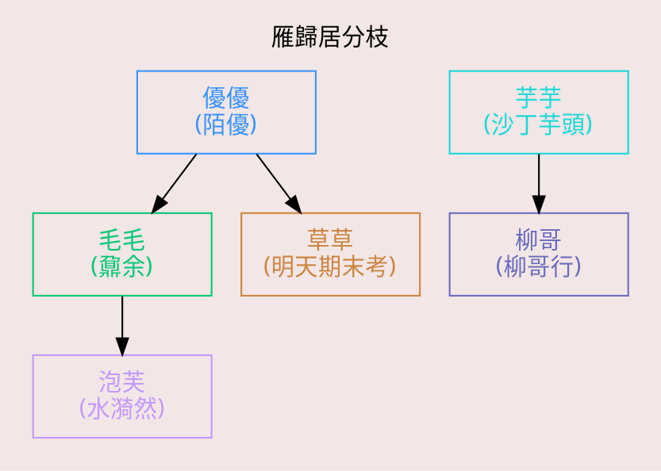
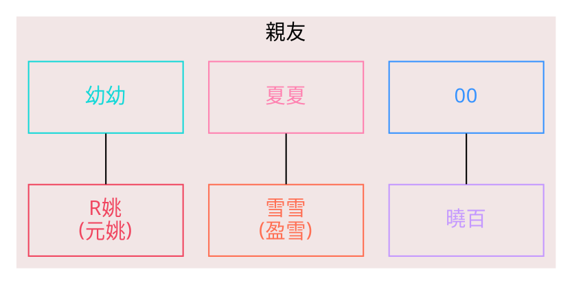
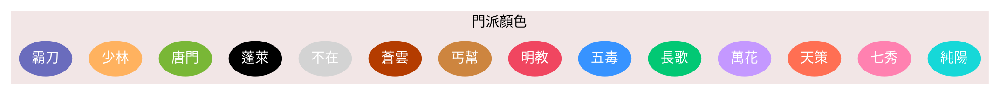

```dot
digraph {
    bgcolor="#F2E6E6";
    label="雁歸居師徒表";
    labelloc="t";
    labeldistance=10;
    node[fontname="微軟正黑體",shape=box,fixedsize=true,height=0.7,width=1.5];
    //"帥氣的小姐姐"[label="帥氣的小姐姐\n(葬雪調)",color="#FF81B0",fontcolor="#FF81B0"]
    "大貓咪"[label="大貓咪\n(昊森)",color="black",fontcolor="black"]
    "藍藍"[label="藍藍\n(藍筠)",color="#02C874",fontcolor="#02C874"]
    "小易"[label="小易\n(月玲花)",color="lightgray",fontcolor="lightgray"]
    "清清"[label="清清\n(霽瑤)",color="#CD853F",fontcolor="#CD853F"]
    "幼幼"[label="幼幼\n(幼刀)",color="#16D8D8",fontcolor="#16D8D8"]
    "塵塵"[label="塵塵\n(沐塵緣)",color="#02C874",fontcolor="#02C874"]
    //"羊肉爐"[label="羊肉爐\n(墨曲紫濤)",color="#16D8D8",fontcolor="#16D8D8"]
    "柳柳"[label="柳柳\n(薄柳)",color="#02C874",fontcolor="#02C874"]
    //"小九"[label="小九\n(柳朔方)",color="#6A6CBD",fontcolor="#6A6CBD"]
    "夏夏"[label="夏夏\n(芸夏)",color="#FF81B0",fontcolor="#FF81B0"]
    "R靈"[label="R靈\n(鉭靈)",color="#FFB25F",fontcolor="#FFB25F"]
    "白白"[label="白白\n(阡月)",color="#F04660",fontcolor="#F04660"]
    //"R涼"[label="R涼\n(涼宸)",color="#16D8D8",fontcolor="#16D8D8"]
    "阿皮"[label="阿皮\n(皮醬)",color="#C498FF",fontcolor="#C498FF"]
    "00"[label="00\n(雲紫靈)",color="#3793FF",fontcolor="#3793FF"]
    //"小天"[label="小天\n(傲凌雲濤)",color="black",fontcolor="black"]
    "淺淺"[label="淺淺\n(萸淺)",color="#3793FF",fontcolor="#3793FF"]
    //"小貓貓"[label="小貓貓\n(貓尾蝶)",color="lightgray",fontcolor="lightgray"]
    "緋緋"[label="緋緋\n(璃惑)",color="#3793FF",fontcolor="#3793FF"]
    "皓呆"[label="皓呆\n(朧川)",color="#79B736",fontcolor="#79B736"]
    "瀾瀾"[label="瀾瀾\n(行瀾)",color="#3793FF",fontcolor="#3793FF"]
    //"阿夜"[label="阿夜\n(長孫雪夜)",color="#B43C00",fontcolor="#B43C00"]
    //"梨子"[label="梨子\n(蘇沐)",color="#FF81B0",fontcolor="#FF81B0"]
    "小開水"[label="小開水\n(板木老大)",color="lightgray",fontcolor="lightgray"]
    "茗茗"[label="茗茗\n(墨血丹樅)",color="#F04660",fontcolor="#F04660"]
    "丹丹"[label="丹丹\n(甯珞)",color="#C498FF",fontcolor="#C498FF"]
    "楠燕"[label="楠燕\n(小楠)",color="#FF81B0",fontcolor="#FF81B0"]
    "琰琰"[label="琰琰\n(庭前賦雪)",color="#6A6CBD",fontcolor="#6A6CBD"]
    //"仟仟"[label="仟仟\n(上雨知弦)",color="black",fontcolor="black"]
    "小貳"[label="小貳\n(非貳)",color="black",fontcolor="black"]
    //"73"[label="73\n(青衫不改去年)",color="black",fontcolor="black"]
    "夜曄空"[label="夜曄空\n(夜曄)",color="#F04660",fontcolor="#F04660"]
    "鹿鹿"[label="鹿鹿\n(佟妍鹿)",color="#6A6CBD",fontcolor="#6A6CBD"]
    "來來"[label="來來\n(誰來剪夜色)",color="black",fontcolor="black"]
    "小茄子"[label="小茄子\n(花茄子)",color="#C498FF",fontcolor="#C498FF"]
    "小蛋"[label="小蛋\n(鳴花)",color="#C498FF",fontcolor="#C498FF"]
    "喵喵"[label="喵喵\n(喵給本喵跪下)",color="#C498FF",fontcolor="#C498FF"]

    {rank = same;大貓咪 "暱稱\n(ID)"}
    大貓咪->{R靈 阿皮 小易 夏夏 塵塵 淺淺 皓呆 鹿鹿}
    淺淺->{琰琰 柳柳 來來 小茄子}
    {白白 淺淺}->小開水
    白白->{喵喵}
    小易->{清清 幼幼}
    阿皮->{00 柳柳 茗茗 丹丹 小蛋}
    R靈->{藍藍 緋緋 茗茗}
    茗茗->{瀾瀾}
    緋緋->{夜曄空}
    夏夏->{楠燕}
    小開水->{小貳}
}
```

```dot
digraph{
    labelloc="t";
    node[fontname="微軟正黑體",shape=box,fixedsize=true,height=0.7,width=1.5];
    bgcolor="#F2E6E6";
    color="#F2E6E6";
       subgraph cluster{
        芋頭[label="芋芋\n(沙丁芋頭)",color="#16D8D8",fontcolor="#16D8D8"];
        柳哥[label="柳哥\n(柳哥行)",color="#6A6CBD",fontcolor="#6A6CBD"];
        芋頭->柳哥
   }
    subgraph cluster{
        label=雁歸居分枝
        bgcolor="#F2E6E6";
        color="#F2E6E6";
        優優[label="優優\n(陌優)",color="#3793FF",fontcolor="#3793FF"];
        優優[label="優優\n(陌優)",color="#3793FF",fontcolor="#3793FF"];
        毛毛[label="毛毛\n(鼐余)",color="#02C874",fontcolor="#02C874"];
        草草[label="草草\n(明天期末考)",color="#CD853F",fontcolor="#CD853F"];
        泡芙[label="泡芙\n(水漪然)",color="#C498FF",fontcolor="#C498FF"];
        優優->{毛毛 草草}
        毛毛->{泡芙}
    }
}
```

```dot
graph{
    subgraph cluster{
    bgcolor="#F2E6E6";
    color="#F2E6E6";
    labelloc="t";
    labeldistance=10;
    node[fontname="微軟正黑體",shape=box,fixedsize=true,height=0.7,width=1.5];
    label="親友";
    "00" [color="#3793FF",fontcolor="#3793FF"];
    "夏夏"[color="#FF81B0",fontcolor="#FF81B0"];
    "幼幼"[color="#16D8D8",fontcolor="#16D8D8"];
    "R姚"[label="R姚\n(元姚)",color="#F04660",fontcolor="#F04660"];
    "曉百" [color="#C498FF",fontcolor="#C498FF"];
    "雪雪" [label="雪雪\n(盈雪)",color="#FF6F53",fontcolor="#FF6F53"];
    夏夏--雪雪;
    幼幼--R姚;
    00 -- 曉百;
    }
}
```

```dot
graph{
    subgraph cluster{
    label="門派顏色";
    color="#F2E6E6";
    style=filled;
    node [style=solid,style=filled,fontname="微軟正黑體",fixedsize=true,fontcolor=white];
    純陽[color="#16D8D8"]
    七秀[color="#FF81B0"]
    天策[color="#FF6F53"]
    萬花[color="#C498FF"]
    長歌[color="#02C874"]
    五毒[color="#3793FF"]
    明教[color="#F04660"]
    丐幫[color="#CD853F"]
    蒼雲[color="#B43C00"]
    不在[color="lightgray"]
    蓬萊[color="black"]
    唐門[color="#79B736"]
    少林[color="#FFB25F"]
    霸刀[color="#6A6CBD"]
    }
}
```
